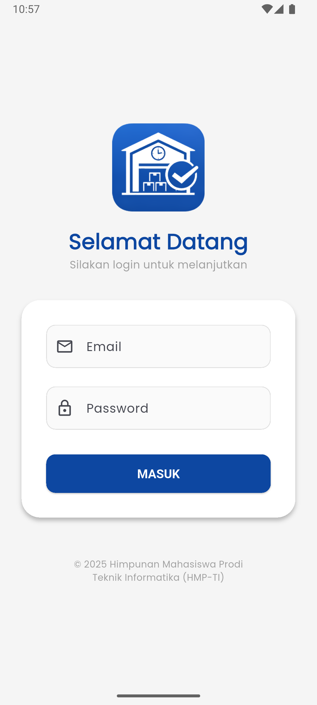
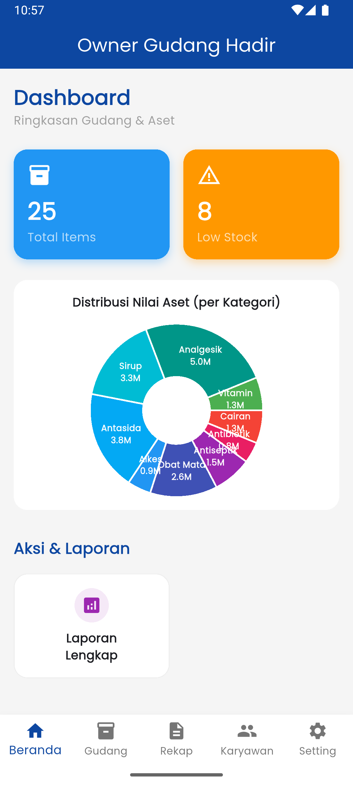
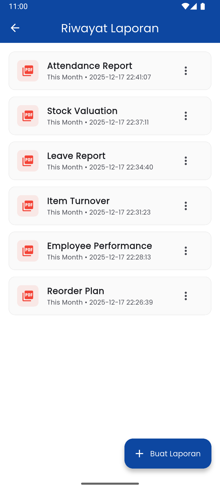

# GudangHadir

<div align="center">


**Sistem Informasi Gudang Terintegrasi dengan Absensi Digital**

[](https://flutter.dev)
[](https://riverpod.dev)
[](LICENSE)

Created with ❤️ by **Himpunan Mahasiswa Prodi Teknik Informatika (HMP-TI)**

</div>

---

## 📖 Tentang Aplikasi

**Gudang Hadir** adalah solusi all-in-one untuk manajemen stok gudang dan absensi karyawan yang dirancang khusus untuk operasional bisnis modern. Dibangun menggunakan teknologi **Flutter** terbaru, aplikasi ini menawarkan antarmuka yang modern, cepat, dan mudah digunakan (User Friendly).

### 🚀 Fitur Utama

#### 📦 Manajemen Gudang (Warehouse)
*   **Real-time Stock**: Pantau jumlah stok barang masuk dan keluar secara instan.
*   **Input Mudah**: Tambah barang baru atau update stok dengan beberapa ketukan.
*   **Low Stock Alert**: Notifikasi visual untuk barang yang stoknya menipis.

#### 📍 Absensi Cerdas (Attendance)
*   **QR Code Scan**: Presensi cepat dan aman dengan memindai kode QR unik.
*   **Geo-Tagging (GPS)**: Validasi lokasi karyawan untuk memastikan kehadiran di tempat kerja.
*   **Riwayat**: Karyawan dapat melihat log kehadiran mereka sendiri.

#### � Laporan & Analisis
*   **5 Laporan Utama**: Valuasi Stok, Reorder Plan, Item Turnover, Kinerja Karyawan, Histori Absensi.
*   **Export Fleksibel**: Unduh laporan dalam format **PDF** atau **Excel**.
*   **Cloud History**: Riwayat laporan tersimpan otomatis di cloud dan bisa diunduh kapan saja tanpa generate ulang.
*   **Filter Canggih**: Filter berdasarkan tanggal (Harian, Bulanan, Custom) untuk analisis presisi.

#### 📝 Cuti & Perizinan
*   **Pengajuan Mudah**: Karyawan mengajukan cuti/ sakit/ izin langsung dari aplikasi.
*   **Smart Approval**: Admin dapat melihat **Riwayat Kehadiran** karyawan sebelum tanggal cuti untuk bahan pertimbangan.
*   **Approval System**: Setujui atau tolak dengan satu klik.
*   **Surat Cuti Digital**: Otomatis generate PDF surat cuti yang sah.

#### 💰 Manajemen Penggajian (Payroll)
*   **Auto Calculation**: Hitung gaji bersih otomatis berdasarkan kehadiran, lembur, dan denda keterlambatan/absen.
*   **Payroll Config**: Atur gaji pokok dan tunjangan (makan & transport) per karyawan secara fleksibel.
*   **Digital Payslip**: Generate Slip Gaji (PDF) resmi lengkap dengan tanda tangan dan stempel digital.

#### 🤖 Smart AI Assistant
*   **Powered by Gemini**: Asisten pintar berbasis AI untuk membantu Admin menganalisis data gudang dan absensi.
*   **Data Insight**: Tanya jawab seputar stok barang, tren kehadiran, atau saran manajemen operasional.

#### 👥 Manajemen Pengguna & Utilitas
*   **Multi-Role**: Admin, Owner, Employee dengan hak akses berbeda.
*   **Signature & Stamp**: Pengaturan tanda tangan dan stempel digital untuk dokumen resmi (Cuti & Slip Gaji).
*   **Data Seeding**: Fitur "Seed Reports" untuk mengisi data dummy (User, Absensi, Transaksi, Cuti, Payroll) guna keperluan testing/demo.
*   **Profile Management**: Update foto dan info profil pengguna.

---

## 🛠️ Teknologi

Aplikasi ini dibangun menggunakan *stack* teknologi modern:
*   **Framework**: Flutter SDK
*   **Language**: Dart 3.x
*   **AI Engine**: Google Gemini AI (Generative AI)
*   **State Management**: Flutter Riverpod
*   **Backend & Database**: Appwrite Cloud (Database, Auth, Storage)
*   **Reporting**: PDF & Excel Generators, Fl_Chart
*   **Navigation**: GoRouter
*   **Features**: Mobile Scanner (QR), Geolocator (GPS)

---

## 📸 Screenshots

| Login Screen | Dashboard Admin | Scan QR | Reporting |
|:---:|:---:|:---:|:---:|
|  |  |  |  |

---

## 🔧 Cara Instalasi

1.  **Clone Repository**
    ```bash
    git clone https://github.com/hmp-ti/gudang-hadir.git
    cd gudang_hadir
    ```

2.  **Install Dependencies**
    ```bash
    flutter pub get
    ```

3.  **Setup Appwrite**
    *   Buat project di [Appwrite Console](https://cloud.appwrite.io).
    *   Buat Database dan Collection: `users`, `items`, `attendances`, `leaves`, `generated_reports`, `app_settings`, `payroll_configs`, `payrolls`.
    *   **PENTING**: Lihat file [DATABASE_SCHEMA.md](DATABASE_SCHEMA.md) untuk detail lengkap tabel dan kolom yang harus dibuat.
    *   Buat Storage Bucket: `general_storage` (untuk PDF/Excel/Foto).
    *   Update `AppwriteConfig` di `lib/core/config` dengan Project ID dan Endpoint Anda.

4.  **Setup Gemini AI**
    *   Dapatkan API Key di [Google AI Studio](https://aistudio.google.com/).
    *   Inisialisasi `Gemini.init(apiKey: 'YOUR_API_KEY')` di `lib/main.dart`.

5.  **Run Application**
    ```bash
    flutter run
    ```

---

## 🔐 Akun Demo

### 🔑 Credential Login
Berikut adalah akun demo yang bisa Anda gunakan (jika sudah didaftarkan):

| Role | Email | Password |
| :--- | :--- | :--- |
| **Admin** | `admin@mail.com` | `12345678` |
| **Owner** | `owner@mail.com` | `12345678` |
| **Karyawan** | `karyawan1@mail.com` | `12345678` |

> **Catatan**: Jika akun belum ada, silakan **Register** melalui aplikasi lalu ubah role di database sesuai tabel di atas.

---

## 🔜 Next Update / Upcoming Features

Berikut adalah fitur yang direncanakan untuk pengembangan selanjutnya:

*   [ ] **Notifikasi (FCM)**: Push notification real-time ke HP karyawan saat cuti disetujui atau stok menipis.
*   [ ] **Dashboard Chart**: Visualisasi data (Grafik Batang/Pie) di Dashboard Admin untuk insight instan.
*   [ ] **Foto Absensi (Selfie)**: Mewajibkan foto selfie saat melakukan absensi via GPS untuk validasi tambahan.
*   [ ] **Barcode Scanner Barang**: Scan barcode produk menggunakan kamera HP untuk Stock Opname atau Transaksi cepat.
*   [ ] **Multi-Gudang**: Dukungan untuk mengelola stok di lebih dari satu lokasi cabang.
*   [ ] **Dark Mode System**: Tema gelap yang menyesuaikan pengaturan sistem HP pengguna.

---

## © Copyright

**Himpunan Mahasiswa Prodi Teknik Informatika (HMP-TI)**
Universitas Islam Kalimantan Muhammad Arsyad Al-Banjari Banjarmasin.

*Made for educational purposes and internal management solutions.*
